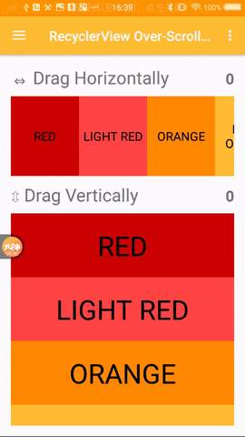

[  ](https://bintray.com/trenail/maven/overscroll-decor/_latestVersion)

# 支持所有可滚动View 的 越界回弹效果，支持横向纵向，例如 RecyclerView, ListView, GridView, ScrollView ...
 
该项目从 https://github.com/EverythingMe/overscroll-decor 而来，并在此基础上增加了 抛掷越界回弹效果
该项目提供了类似于ios的越界回弹效果（android默认的是水波纹效果），支持所有View，自定义控件也可以很方便的使用该功能


1.该项目不是一个UI库，不提供任何View<br/> 
2.使用该项目可以为 原生或自定义View 添加越界回弹效果<br/> 
3.使用简单，一行代码<br/> 
4.扩展方便，支持自定义布局管理器，自定义控件




# Gradle 依赖


将以下内容添加到模块的 build.gradle 文件中

```groovy
dependencies {
    // ...
    
    implementation 'me.trenail:overscroll-decor:1.0.5'
}
```

# 使用

### RecyclerView

支持线性布局管理器，网格布局管理器，而且稍加改动，就能支持自定义布局管理器


```java
RecyclerView recyclerView = (RecyclerView) findViewById(R.id.recycler_view);
    
// Horizontal
OverScrollDecoratorHelper.setUpOverScroll(recyclerView, OverScrollDecoratorHelper.ORIENTATION_HORIZONTAL);
// Vertical
OverScrollDecoratorHelper.setUpOverScroll(recyclerView, OverScrollDecoratorHelper.ORIENTATION_VERTICAL);
```


### ListView

```java
ListView listView = (ListView) findViewById(R.id.list_view);
OverScrollDecoratorHelper.setUpOverScroll(listView);
```

### GridView

```java
GridView gridView = (GridView) findViewById(R.id.grid_view);
OverScrollDecoratorHelper.setUpOverScroll(gridView);
```

### ViewPager

```java
ViewPager viewPager = (ViewPager) findViewById(R.id.view_pager);
OverScrollDecoratorHelper.setUpOverScroll(viewPager);
```

### ScrollView

```java
ScrollView scrollView = (ScrollView) findViewById(R.id.scroll_view);
OverScrollDecoratorHelper.setUpOverScroll(scrollView);
```

### HorizontalScrollView
```java
HorizontalScrollView horizontalScrollView = (HorizontalScrollView) findViewById(R.id.horizontal_scroll_view);
OverScrollDecoratorHelper.setUpOverScroll(horizontalScrollView);
```

### 其他View- TextView, ImageView... 

```java
View view = findViewById(R.id.demo_view);
    
// Horizontal
OverScrollDecoratorHelper.setUpStaticOverScroll(view, OverScrollDecoratorHelper.ORIENTATION_HORIZONTAL);
// Vertical
OverScrollDecoratorHelper.setUpStaticOverScroll(view, OverScrollDecoratorHelper.ORIENTATION_VERTICAL);
```


设置状态监听器


```java

// Note: over-scroll is set-up using the helper method.
IOverScrollDecor decor = OverScrollDecoratorHelper.setUpOverScroll(recyclerView, OverScrollDecoratorHelper.ORIENTATION_HORIZONTAL);

decor.setOverScrollStateListener(new IOverScrollStateListener() {
    @Override
	public void onOverScrollStateChange(IOverScrollDecor decor, int oldState, int newState) {
	    switch (newState) {
	        case STATE_IDLE:
	            // No over-scroll is in effect.
	            break;
	        case STATE_DRAG_START_SIDE:
	            // Dragging started at the left-end.
	            break;
	        case STATE_DRAG_END_SIDE:
	            // Dragging started at the right-end.
	            break;
	        case STATE_FLING:
	            //抛掷越界状态
	            break;
	        case STATE_BOUNCE_BACK:
	            if (oldState == STATE_DRAG_START_SIDE) {
	                // Dragging stopped -- view is starting to bounce back from the *left-end* onto natural position.
	            } else { // i.e. (oldState == STATE_DRAG_END_SIDE)
	                // View is starting to bounce back from the *right-end*.
	            }
	            break;
	    }
	}
}
```

#### 设置偏移监听器

```java
// Note: over-scroll is set-up by explicity instantiating a decorator rather than using the helper; The two methods can be used interchangeably for registering listeners.
VerticalOverScrollBounceEffectDecorator decor = new VerticalOverScrollBounceEffectDecorator(new RecyclerViewOverScrollDecorAdapter(recyclerView, itemTouchHelperCallback));

decor.setOverScrollUpdateListener(new IOverScrollUpdateListener() {
    @Override
    public void onOverScrollUpdate(IOverScrollDecor decor, int state, float offset) {
    	final View view = decor.getView();
    	if (offset > 0) {
    		// 'view' is currently being over-scrolled from the top.
    	} else if (offset < 0) {
    		// 'view' is currently being over-scrolled from the bottom.
    	} else {
    		// No over-scroll is in-effect.
    		// This is synonymous with having (state == STATE_IDLE).
    	}
    }
});

```


    
### 自定义控件使用

```java
public class CustomView extends View {
    // ...
}
    
final CustomView view = (CustomView) findViewById(R.id.custom_view);
new VerticalOverScrollBounceEffectDecorator(new IOverScrollDecoratorAdapter() {

    @Override
    public View getView() {
        return view;
    }

    @Override
    public boolean isInAbsoluteStart() {
	    // canScrollUp() is an example of a method you must implement
        return !view.canScrollUp();
    }

    @Override
    public boolean isInAbsoluteEnd() {
	     // canScrollDown() is an example of a method you must implement
        return !view.canScrollDown();
    }
});
```


### 取消越界效果（恢复默认效果）
```java
IOverScrollDecor decor =  OverScrollDecoratorHelper.setUpOverScroll(listView);
decor.attach();
```


